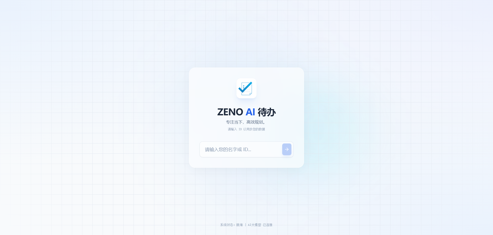
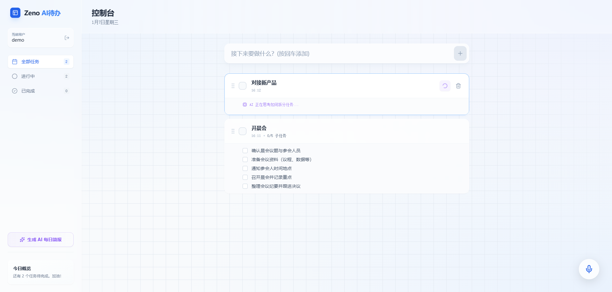
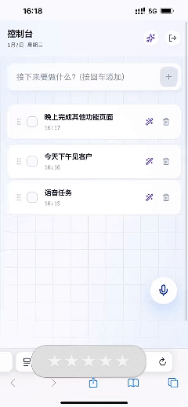

<div align="center">
  
  <h1>ZenoFlow Lite</h1>
  
  <p>
    <strong>一款 0 配置、无后端、100% 隐私安全的 React 任务管理系统</strong><br>
    <em>拒绝繁琐部署，下载即用，让数据真正属于你自己。</em>
  </p>

  <p>
    <a href="#为什么选择纯前端">核心优势</a> • 
    <a href="#功能对比-pro-vs-lite">功能对比</a> • 
    <a href="#快速开始">快速运行</a> • 
    <a href="#私域交流">获取商业版</a>
  </p>

  
  
  
  
</div>

---

<div align="center">
  <br/>
  <!-- 这里放你的主界面截图，alt 写清楚便于 SEO -->
  
  <br/>
  
  <br/>
</div>

<div align="center">
  <h3>📱 移动端完美适配 (Mobile Responsive)</h3>
  <p>在手机上也能享受如丝般顺滑的拖拽排序体验和语音交互。</p>
  
  <!-- 这里的 width 控制显示大小，建议 300-350px，太大会模糊且占地 -->
  
</div>

## 💡 为什么选择纯前端版？(Why Lite?)

在云服务泛滥的今天，我们反其道而行之。**ZenFlow Lite** 是为了那些追求**极致速度**和**数据隐私**的用户设计的：

*   🚀 **0 配置部署**：不需要 Docker，不需要数据库，不需要配置服务器。只要你有浏览器，它就能跑。
*   🔒 **绝对隐私**：所有数据存储在浏览器 LocalStorage 中，**没有任何网络请求发送到服务器**。你的计划，只有你自己知道。
*   🎨 **玻璃拟态 UI**：采用了最新的 Glassmorphism 设计语言，甚至能治愈你的“任务拖延症”。
*   ⚡ **极速响应**：没有网络延迟，所有操作毫秒级响应。

## ⚔️ 功能对比 (Pro vs Lite)

我们开源了最核心的交互体验，适合个人开发者学习 React 19 新特性或作为个人工具使用。
如果您需要团队协作或 AI 辅助，请关注我们的 **Pro 商业版**。

| 功能模块 | Lite 开源版 (本项目) | Pro 商业版 (闭源) |
| :--- | :---: | :---: |
| **基础体验** | | |
| 部署难度 | **极低 (纯静态)** | 低 (Docker一键部署) |
| 数据存储 | LocalStorage (本地) | Cloud DB (云端/私有化) |
| 玻璃拟态 UI | ✅ | ✅ |
| 拖拽排序 (DnD) | ✅ | ✅ |
| **AI 智能化 (核心差异)** | | |
| 语音指令交互 | ❌ | 🔒 **支持 (Whisper模型)** |
| 智能任务拆解 | ❌ | 🔒 **支持 (LLM驱动)** |
| AI 每日简报 | ❌ | 🔒 **支持 (自动生成)** |
| **企业级功能** | | |
| 专属技术支持 | 社区互助 | 1对1 支持 |

👉 **[想体验 AI + 语音操控的完全体？点此扫码联系作者，获取 Pro 版演示](#)** 

## 🚀 快速开始 (Quick Start)

无需任何环境配置，只需两步：

### 方法 1：克隆运行
```bash
# 1. 克隆项目
git clone https://github.com/TheEscArtist/ZenoFlow-Lite.git

# 2. 安装并启动
cd ZenoFlow-Lite
npm install
npm run dev
```

### 方法 2：直接部署
由于是纯静态项目，你可以直接将 `dist` 目录上传到 GitHub Pages, Vercel, Netlify 或任何静态服务器，**无需后端代码**。

## 🛠️ 技术栈 (Tech Stack)

本项目是学习现代化 React 开发的最佳实践案例：

- **Core**: React 19 + Vite + TypeScript + Whisper
- **State**: Hooks (useReducer/Context)
- **Style**: Tailwind CSS + Lucide React
- **Drag & Drop**: `@dnd-kit` (高性能拖拽库)
- **Architecture**: 纯客户端架构 (Client-Side Only)

## 🤝 交流与商业授权 (Contact)

**ZenoFlow** 采用 Open Core 模式运营。
如果你是**企业用户**，或者希望获得**集成 AI 与语音功能的 Pro 版源码**（用于二次开发或商业项目），欢迎加入我们的开发者私域：

<div align="center">
  <!-- 这里替换成你的真实二维码 -->
  
  
  <p>👆 <strong>扫码备注“开源”</strong> 👆</p>
  <p>1. 免费领取《AI+应用落地指南》<br>2. 获取 Pro 版功能演示视频<br>3. 进入技术交流群防脱发</p>
</div>

## 📄 License

本项目代码采用 **AGPL-3.0** 协议开源。

*   ✅ 允许个人免费使用、学习、修改。
*   ⚠️ **商业限制**：禁止直接将本项目打包售卖。如需在商业产品中使用核心代码，请联系作者获取商业授权。